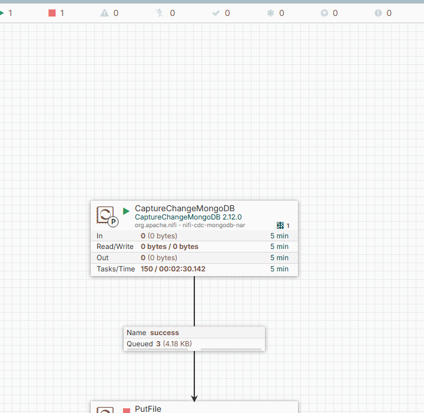
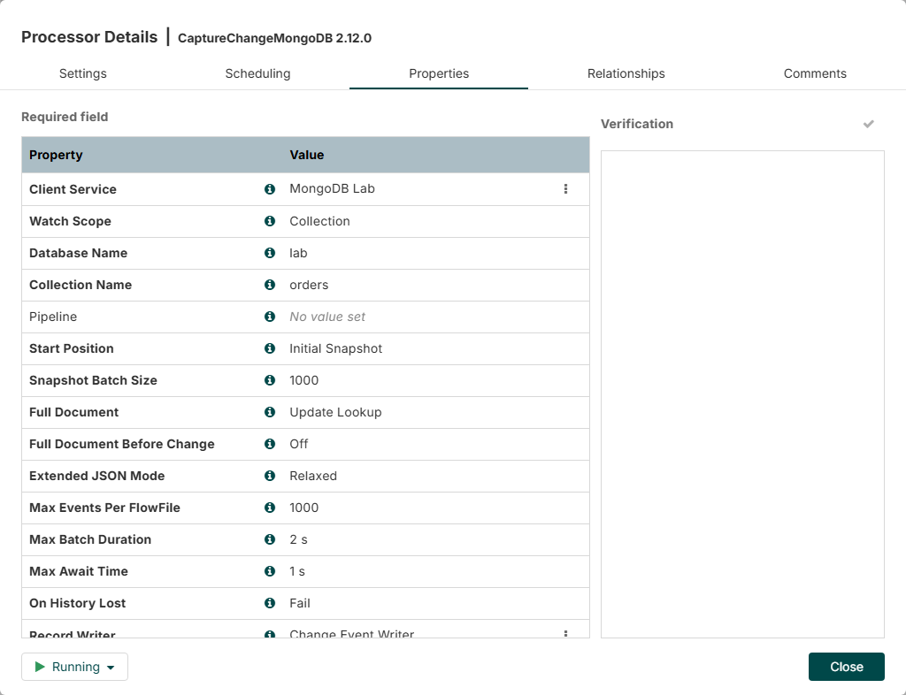
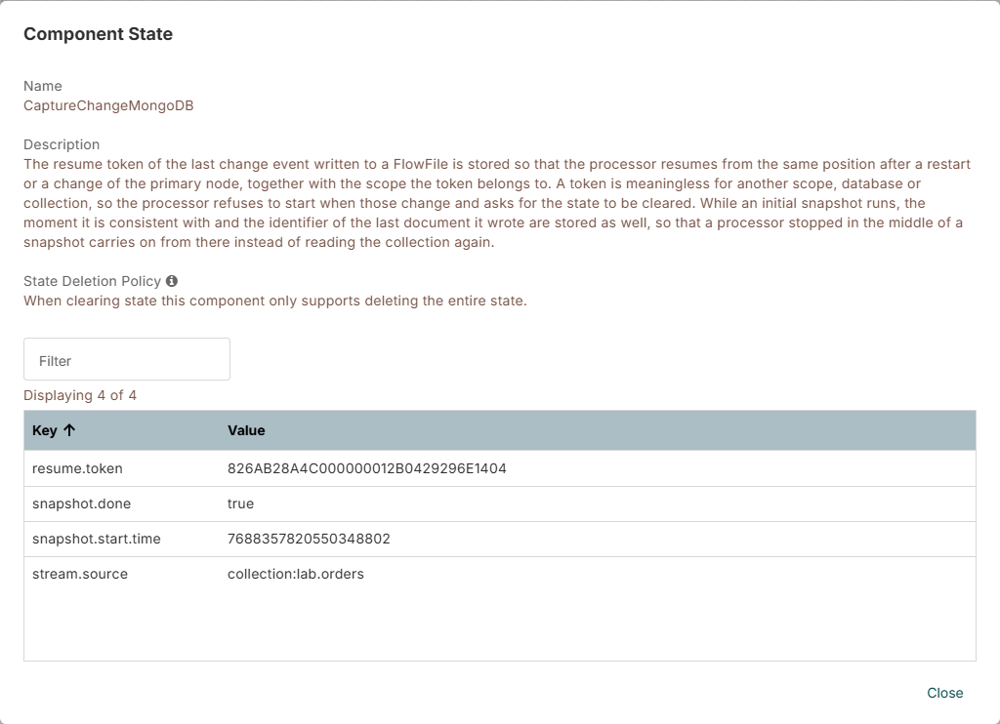
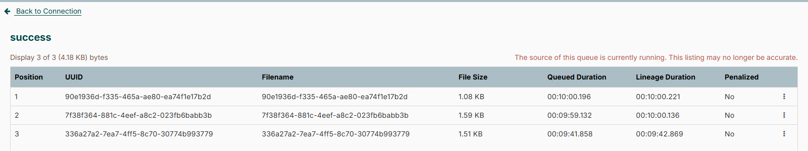
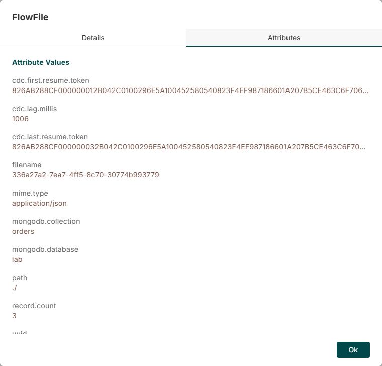
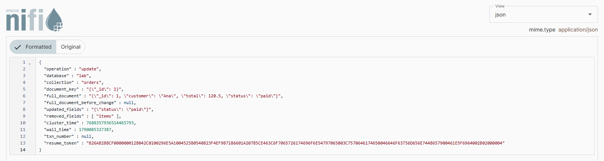

<!--
  Licensed to the Apache Software Foundation (ASF) under one or more
  contributor license agreements.  See the NOTICE file distributed with
  this work for additional information regarding copyright ownership.
  The ASF licenses this file to You under the Apache License, Version 2.0
  (the "License"); you may not use this file except in compliance with
  the License.  You may obtain a copy of the License at
      http://www.apache.org/licenses/LICENSE-2.0
  Unless required by applicable law or agreed to in writing, software
  distributed under the License is distributed on an "AS IS" BASIS,
  WITHOUT WARRANTIES OR CONDITIONS OF ANY KIND, either express or implied.
  See the License for the specific language governing permissions and
  limitations under the License.
-->
# NiFi MongoDB CDC Bundle

`CaptureChangeMongoDB` is an Apache NiFi 2.x processor that streams insert, update, replace, delete and
invalidate events from MongoDB using Change Streams, and writes them as records with a Record Writer. It
keeps the resume token in NiFi cluster state, so it continues where it stopped, and it never writes to the
source database. No Kafka, no Kafka Connect, no Debezium in between.

The module follows the layout and conventions of `nifi-extension-bundles/nifi-cdc` in Apache NiFi and is
intended as a contribution for [NIFI-7180](https://issues.apache.org/jira/browse/NIFI-7180).

## Requirements

- Apache NiFi 2.12.0, Java 21
- MongoDB 6.0 or later, running as a replica set or a sharded cluster. Change Streams do not exist on a
  standalone server, and the processor says so instead of failing later.
- A database user that may read the watched scope. Nothing else is needed:

  ```javascript
  use admin
  db.createRole({
    role: "nifiCdc",
    privileges: [{
      resource: { db: "lab", collection: "orders" },
      actions: [ "changeStream", "find" ]
    }],
    roles: []
  })
  db.createUser({ user: "nifi_cdc", pwd: "...", roles: [{ role: "nifiCdc", db: "admin" }] })
  ```

  For database scope leave the collection empty: `{ db: "lab", collection: "" }`. If the version before a
  change is wanted, the collection has to keep pre-images, which an administrator turns on once:

  ```javascript
  db.runCommand({ collMod: "orders", changeStreamPreAndPostImages: { enabled: true } })
  ```

## Installation

1. Download `nifi-cdc-mongodb-nar-2.12.0.nar` from the
   [releases](https://github.com/danmorcov88/nifi-cdc-mongodb-bundle/releases) or build it with
   `./mvnw package`.
2. Copy the NAR into the `lib/` directory of NiFi, or into the NAR auto-load directory, `nar_extensions/`
   in the Docker image, and start NiFi.
3. Add `CaptureChangeMongoDB` to the canvas, point it at a `MongoDBControllerService`, name the database
   and the collection, and pick a Record Writer. *Verify* on the processor checks the connection, the
   deployment, the server version, the privileges and, when they are asked for, the pre-images.

## How it looks

A collection watched with an initial snapshot, connected to a `PutFile`, with the FlowFiles it produced
still queued between them:



The properties of that processor:



What it keeps in NiFi state: the resume token it will continue from, the scope that token belongs to, and
the snapshot it has already finished.



One FlowFile per batch, here the snapshot followed by the changes:



The attributes of the FlowFile that carries the changes:



And its first record, an update, written by `JsonRecordSetWriter`:



## Example flow

[examples/capture-change-mongodb.json](examples/capture-change-mongodb.json) is the flow definition of
exactly that run: `CaptureChangeMongoDB`, a `MongoDBControllerService`, a `JsonRecordSetWriter` and a
`PutFile`. Import it with *Upload* from the process group menu and adjust the connection URI.

These are the records it produced. The collection held three documents when the processor started, so the
snapshot wrote them first, with the operation `read` and no resume token:

```json
{"operation":"read","database":"lab","collection":"orders","document_key":"{\"_id\": 1}","full_document":"{\"_id\": 1, \"customer\": \"Ana\", \"total\": 120.5, \"status\": \"open\", \"items\": 3}","full_document_before_change":null,"updated_fields":null,"removed_fields":null,"cluster_time":7688357820550348802,"wall_time":null,"txn_number":null,"resume_token":null}
```

Then `{_id: 1}` was updated, `{_id: 4}` inserted and `{_id: 2}` deleted, which arrived in one FlowFile:

```json
{"operation":"update","database":"lab","collection":"orders","document_key":"{\"_id\": 1}","full_document":"{\"_id\": 1, \"customer\": \"Ana\", \"total\": 120.5, \"status\": \"paid\"}","full_document_before_change":null,"updated_fields":"{\"status\": \"paid\"}","removed_fields":["items"],"cluster_time":7688357936514465793,"wall_time":1790085327387,"txn_number":null,"resume_token":"826AB288CF000000012B042C0100296E5A1004525805..."}
{"operation":"insert","database":"lab","collection":"orders","document_key":"{\"_id\": 4}","full_document":"{\"_id\": 4, \"customer\": \"Dan\", \"total\": 15, \"status\": \"open\", \"items\": 1}","full_document_before_change":null,"updated_fields":null,"removed_fields":null,"cluster_time":7688357936514465794,"wall_time":1790085327394,"txn_number":null,"resume_token":"826AB288CF000000022B042C0100296E5A1004525805..."}
{"operation":"delete","database":"lab","collection":"orders","document_key":"{\"_id\": 2}","full_document":null,"full_document_before_change":null,"updated_fields":null,"removed_fields":null,"cluster_time":7688357936514465795,"wall_time":1790085327400,"txn_number":null,"resume_token":"826AB288CF000000032B042C0100296E5A1004525805..."}
```

`Full Document` was `Update Lookup` in this run, which is why the update carries the whole document as
well. The resume tokens are shortened here; in the real output each is one long string.

## Records and attributes

Every record has the same fields, whatever the collection holds. Documents are written as Extended JSON
strings rather than mapped to record fields, so a collection without a fixed shape stays readable.

| Field | Type | Notes |
|---|---|---|
| `operation` | string | `insert`, `update`, `replace`, `delete`, `invalidate`, or `read` for the initial snapshot |
| `database` | string | |
| `collection` | string | empty for an `invalidate` event |
| `document_key` | string | Extended JSON, the `_id` of the document |
| `full_document` | string | Extended JSON; see `Full Document` |
| `full_document_before_change` | string | Extended JSON; needs pre-images, see `Full Document Before Change` |
| `updated_fields` | string | Extended JSON of the fields an update set |
| `removed_fields` | array of string | the fields an update removed |
| `cluster_time` | long | seconds and increment packed into one number, so sorting the field sorts the events |
| `wall_time` | timestamp | when the change happened, as the server saw it |
| `txn_number` | long | the same for every event of one transaction |
| `resume_token` | string | the position of the event; empty for snapshot records |

FlowFile attributes: `mime.type`, `record.count`, `cdc.first.resume.token`, `cdc.last.resume.token`,
`cdc.lag.millis`, `mongodb.database`, and `mongodb.collection` with collection scope.

## Properties

| Property | Default | What it does |
|---|---|---|
| Client Service | — | the `MongoDBControllerService` that holds the connection and the credentials |
| Watch Scope | Collection | one collection, or every collection of a database |
| Database Name | — | the database to watch |
| Collection Name | — | the collection to watch, with collection scope |
| Pipeline | — | an aggregation pipeline the server applies before sending the events |
| Start Position | Now | where a stream without a stored position starts: `Now`, `Timestamp` or `Initial Snapshot` |
| Start Timestamp | — | for `Timestamp`, in seconds since the epoch |
| Snapshot Batch Size | 1000 | documents per batch during the initial snapshot |
| Full Document | Default | whether an update event carries the document as well |
| Full Document Before Change | Off | whether an event carries the version before the change |
| Extended JSON Mode | Relaxed | `Relaxed` reads easily, `Canonical` keeps every BSON type |
| Max Events Per FlowFile | 1000 | events after which a FlowFile is completed |
| Max Batch Duration | 5 s | time after which a FlowFile is completed |
| Max Await Time | 1 s | how long the server holds a request open while nothing changes |
| On History Lost | Fail | what to do when the server can no longer serve the stored position |
| Record Writer | — | writes the events into the FlowFile |

## Delivery and duplicates

Every change is delivered **at least once**. The resume token is stored in the same transaction as the
FlowFiles of its batch, so the stored position can never run ahead of what was delivered. A failure, a
restart or a lost node replays the events after the last committed token; it never steps over them.

That means a consumer has to tolerate a repeat. Every record carries what is needed to recognise one:
`resume_token` identifies the event, `cluster_time` orders it, `document_key` names the document, and
`txn_number` groups the events of a transaction. Keeping the last `resume_token` seen per document, or
writing with `document_key` as the key into a store that overwrites, is enough.

## Things worth knowing before running it

**The oplog is a window.** The server only keeps its recent history. A processor that is stopped, or that
cannot keep up, for longer than that window can no longer continue from its stored position. By default it
then reports an error and keeps the position, so the gap is noticed rather than hidden; `On History Lost`
can be set to `Restart From Now` to give the position up on purpose. An idle stream keeps its stored
position moving forward, so a quiet collection does not fall behind while nothing happens.

**Timeouts belong in the connection string.** MongoDB waits forever by default, so a server that hangs
would hold a trigger open. Set them on the client service, for example
`mongodb://host:27017/?connectTimeoutMS=10000&socketTimeoutMS=30000&serverSelectionTimeoutMS=10000`.

**The stored position belongs to one scope.** Pointing the processor at another database or collection
without clearing its state is refused, with a message naming both.

**One node at a time.** The processor is `@PrimaryNodeOnly` and `@TriggerSerially`: one cursor, one node.

## Compatibility

| | tested |
|---|---|
| Apache NiFi | 2.12.0 |
| MongoDB | 7.0 and 8.0 as a single-node replica set, in the integration tests. 6.0 is the lowest version the processor accepts. |
| Java | 21 |
| MongoDB driver | `mongodb-driver-sync` 5.11.0, from `nifi-mongodb-client-service-api-nar` |

## Limitations

- Deployment scope, meaning a whole cluster at once, is not possible: `MongoDBClientService` exposes a
  `MongoDatabase` and not the `MongoClient` such a stream needs. See [docs/prior-art.md](docs/prior-art.md).
- The initial snapshot reads one collection, so it cannot be combined with database scope.
- DDL events other than `drop` and `invalidate`, for example `createIndexes`, are not expanded.
- A sharded cluster uses the same code path but is not covered by the test matrix yet.
- The 24 hour run against a self-hosted replica set described in the project plan has not been done yet.

## Build

```
./mvnw verify                        # compile, unit tests, NAR
./mvnw verify -P contrib-check       # same, plus the upstream RAT, checkstyle and PMD checks
./mvnw verify -P integration-tests   # also runs the Testcontainers suite (needs Docker)
```

The NAR is produced at `nifi-cdc-mongodb-nar/target/nifi-cdc-mongodb-nar-2.12.0.nar`.

## Development lab

`docker/compose.yml` starts a single-node MongoDB replica set and a NiFi 2.12.0 container that loads the
built NAR:

```
docker compose -f docker/compose.yml up -d mongo
./mvnw package
docker compose -f docker/compose.yml --profile nifi up -d    # https://localhost:8443/nifi
```

NiFi signs in with `admin` / `adminadminadmin`. From NiFi the connection URI is
`mongodb://mongo:27017/?replicaSet=rs0`; from the host machine use
`mongodb://localhost:27017/?directConnection=true`. The lab runs without authentication.

## How it works

[docs/how-it-works.md](docs/how-it-works.md) describes where a stream starts, what is kept in state, what
happens on an invalidate, what happens when the position is lost, and how the snapshot hands over to the
stream.

## License

Apache License 2.0.
